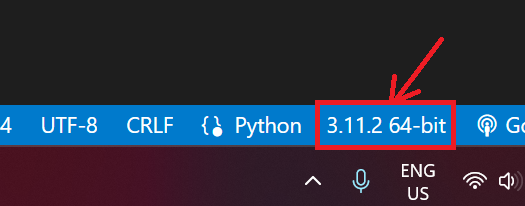
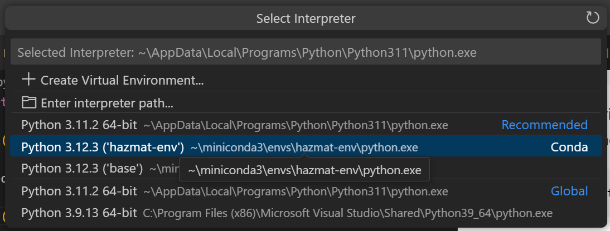
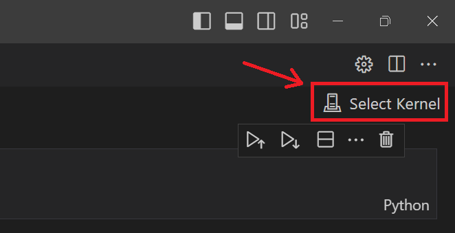
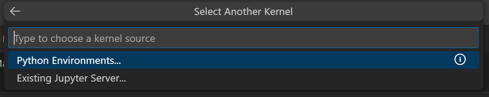
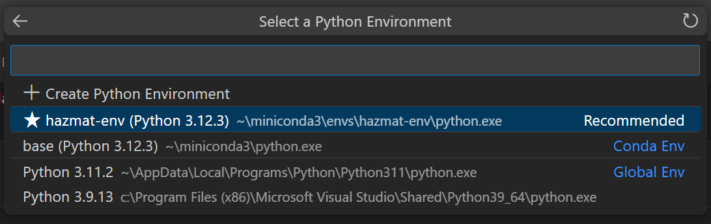

# Hazmat project

## Table of contents

[Hazmat Project](#hazmat-project)

- [Table of contents](#table-of-contents)
- [Introduction](#introduction)
- [Project setup](#project-setup)
  - [Prerequisites](#prerequisites)
  - [Project folder structure](#project-folder-structure)
  - [Creating the python enviornment](#creating-the-python-enviornment)
  - [Activating the environment](#activating-the-environment)
  - [Adding new packages to the project](#adding-new-packages-to-the-project)
- [Running the project](#running-the-project)
- [Results](#results)

---

## Introduction

---

## Project setup

### Prerequisites

In order to start development on the project you need to have [miniconda3](https://docs.anaconda.com/free/miniconda/) installed on your machine. You will also need an IDE installed in order to run and develop the project files ([VSCode](https://code.visualstudio.com/))

### Project folder structure

    .
    ├── data                       # Folder containing the data used in the project
    ├── notebooks                  # Jupyter notebooks folder used for experimenting and developing the model
    ├── scripts                    # Contains commands used for project setup
    ├── src                        # Folder containing the source files of the project (e.g. model, data loader, preprocessor, etc.)
    ├── environment.yml            # File containing the conda environment description
    ├── README.md                  # Readme file containing the project information
    └── requirements.txt           # Requirements file containing the libraries used in the project

### Creating the python enviornment

1. To create the python environment you will need to access a terminal with miniconda installed. To check if you have miniconda installed in your terminal you can run the command

```sh
> conda --version
```

2. If the conda is installed but doesn't appear in your terminal you can start Anaconda Prompt (miniconda3) from your Start Menu.

3. Navigate to your project folder in your terminal

```sh
> cd /path/to/your/project/hazmat-project
```

4. Run the environment creation command. This command can also be found in the scripts folder, [here](./scripts/create_environment.sh)

```sh
> conda env create -f environment.yml
```

### Activating the environment

1. After the installation has finished you can activate the newly created environment in the terminal. The name of the environment can be found at the top of the [environment.yml](./environment.yml) file.

```sh
> conda activate hazmat-env
```

2. In order to use this environment in VSCode you need to select it after opening a python [file](./src/main.py).




3. To activate it in a Jupyter notebook you need to open a [notebook file](./notebooks/test_notebook.ipynb) and select the the newly created environment.





4. In order for the VSCode terminal to also use the new environment you need to restart the IDE.

### Adding new packages to the project

1. All the packages used in this project can be found in the [requirements.txt](./requirements.txt) file. To add a new package you need to add it in this file on a new line as follows:

```txt
numpy
pandas
matplotlib
my-new-package            # The package you want to add
my-new-package==1.0.2     # If you want to use a specific version of the package
...
```

2. To update the packages in the environment, open a new terminal and make sure that your environment is activated (This sometimes is done automatically by VSCode). Then you need to run a pip command to update the project. The command can also be found in [this script file](./scripts/update_requirements.sh)

```sh
(hazmat-env) > pip install -r requirements.txt
```

Done! Now you can start developing this project.

---

## Running the project

---

## Results
